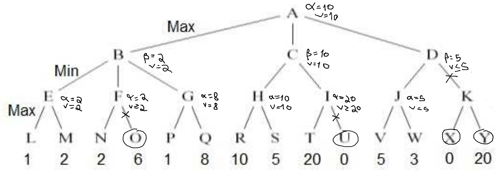

### Exam 2020

#### Question 1

##### Item 1.1)

State: a 3x3 matrix of 0s (red) and 1s (white):
```txt
G = [
    [G11, G12, G13],
    [G21, G22, G23],
    [G31, G32, G33]
]
```

Initial state: any valid random configuration of the game state.

Objective test: all elements of the matrix are 1s.

Operators:
- Swap pieces inside any 4x4 square;
- Swap all pieces.

##### Item 1.2)

The ramification factor of the search tree is exactly 5 in all circumstances, as for each board there are exactly five possible moves: swap (11, 12, 21, 22), (12, 13, 22, 23), (21, 22, 31, 32), (22, 23, 32, 33) and swap all pieces.

The state space of this problem has 2^9 = 512 possible states.

##### Item 1.3)

In both cases:

```txt
                010 
                010 
                111 
                 |  
         +---+---+---+---+
         |   |   |   |   |
        100 001 010 010 101
        100 001 100 001 101
        111 111 001 100 000
         |
 +---+---+
010 111
010 111
111 111
```

##### Item 1.4)

An admissible function is the number of red pieces in the board, as we will necessarily have to flip those before arriving at an answer.

```c++
int h(Matrix G){
    int res = 0;
    for(int i = 0; i < 3; ++i)
        for(int j = 0; j < 3; ++i)
            res += (G[i][j] == 0);
    return res;
}
```

#### Question 3

##### Item 3.10)



##### Item 3.11)

"The minimax algorithm, when applied to complex games, allows fast albeit imprecise answers": true, as we can control the depth at which the minimax algorithm should stop before evaluating the states.

"and allows to manage the maximum time to obtain a solution": partially true; one can indirectly control the time it takes by controling the depth.

"For instance, we can define a maximum time of 30 seconds to get a solution and the algorithm can return a solution after those 30 seconds": false, as interrupting a minimax algorithm at any point does not even guarantee it will find the next best move.
